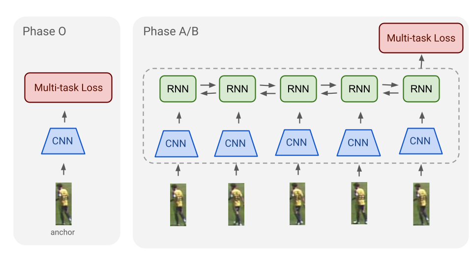

# Jersey Number Recognition

## Model Architecture



The project implements a multi-phase approach for jersey number recognition from video sequences:

### Phase 0: Basic Single-Frame Models
- **Architecture**: CNN Backbone (ResNet18/EfficientNet) → Feature Vector → 2 FC Heads (tens, ones)
- **Models**: `basic_r18`, `basic_effb0`, `basic_effl0`, `basic_mv3l`, `basic_mv3s`, `basic_sv2`

### Phase A: Sequence Baseline Models
- **Architecture**: CNN Encoder (ResNet18) → RNN (GRU/LSTM/RNN, bidirectional/unidirectional) → Temporal Pooling → 2 FC Heads
- **Models**: `seq_brnn_mp`, `seq_urnn_fs`, `seq_bgru_mp`, `seq_ugru_fs`, `seq_blstm_mp`, `seq_ulstm_fs`
- **Config**: hidden_dim=128, single layer, bidirectional uses mean-pool, unidirectional uses final state

### Phase B: Attention Models
- **Architecture**: CNN Encoder (ResNet18) → GRU → Attention Mechanism → 2 FC Heads
- **Attention Variants**:
  - **Bahdanau** (additive): `attn_bgru_bahdanau`
  - **Luong** (dot-product): `attn_bgru_luong`
  - **Gate** (gated pooling): `attn_bgru_gate`, `attn_ugru_gate`
  - **Hard-Concrete** (top-k sparse): `attn_bgru_hc`, `attn_ugru_hc`
- **Config**: ResNet18 backbone, hidden_dim=128, single layer

## Repository Structure

```
jersey_number_recognition/
├── models/
│   ├── basic.py          # Phase 0: Single-frame models
│   ├── sequence.py       # Phase A: Sequence baseline models
│   ├── attention.py      # Phase B: Attention models
│   ├── common.py         # Shared utilities
│   └── __init__.py       # Model factory
├── experiments/
│   ├── phase0_*.py       # Phase 0 experiment scripts
│   ├── phaseA_*.py       # Phase A experiment scripts
│   ├── phaseB_*.py       # Phase B experiment scripts
│   └── *.sh              # Shell scripts for training/comparison
├── analysis/             # Analysis and evaluation scripts
├── scripts/              # Utility scripts
├── config.py             # Configuration management
├── data.py               # Data loading
├── trainer.py            # Training loop
├── main.py               # CLI entrypoint
└── requirements.txt      # Dependencies
```

## Running Experiments

### Single Model Training
```bash
python main.py --model_type <model_name> [--epochs N] [--batch_size B] [--lr LR] [--seed S]
```

**Examples:**
```bash
# Phase 0: Basic model
python main.py --model_type basic_r18 --epochs 30

# Phase A: Sequence model
python main.py --model_type seq_bgru_mp --epochs 30

# Phase B: Attention model with discriminative LR
python main.py --model_type attn_bgru_bahdanau --epochs 30 --use_discriminative_lr --scheduler cosine
```

### Multi-Seed Experiments
```bash
# Phase B multi-seed experiments (runs 5 seeds, computes statistics)
python experiments/phaseB_multi_seed.py
```

### Batch Training (Shell Scripts)
```bash
# Train all models in a phase
cd experiments/
./phase0_train_all.sh    # Phase 0
./phaseA_train_all.sh    # Phase A
./phaseB_train_all.sh    # Phase B

# Compare models within a phase
./phase0_compare.sh
./phaseA_compare.sh
./phaseB_compare.sh
```

## Best Model: attn_bgru_luong

The **attn_bgru_luong** model achieves the highest accuracy at **98.63%** on the test set, making it the best-performing model in this project.

### Parameter Breakdown

**Total Parameters: 11,740,757**

| Component | Parameters | Percentage |
|-----------|------------|------------|
| ResNet18 Backbone | 11,176,512 | 95.2% |
| Bidirectional GRU | 492,288 | 4.2% |
| Luong Attention | 65,792 | 0.56% |
| Classifier Heads | 5,397 | 0.05% |

#### Detailed Component Analysis:

1. **ResNet18 Backbone** (11,176,512 params)
   - ImageNet-pretrained ResNet18 with final classification layer removed
   - Feature dimension: 512
   - Calculation: 11,689,512 (full ResNet18) - 513,000 (removed FC layer) = 11,176,512

2. **Bidirectional GRU** (492,288 params)
   - Input size: 512 (from ResNet18 features)
   - Hidden size: 128 per direction
   - Output dimension: 256 (bidirectional)
   - Formula: 2 directions × 3 gates × (512×128 + 128×128 + 128) = 492,288

3. **Luong Attention** (65,792 params)
   - Query projection: `Linear(256, 128)` = 32,896 params
   - Key projection: `Linear(256, 128)` = 32,896 params

4. **Classification Heads** (5,397 params)
   - Tens digit: `Linear(256, 11)` = 2,827 params (digits 0-9 + blank)
   - Ones digit: `Linear(256, 10)` = 2,570 params (digits 0-9)

### Performance

- **Best Test Accuracy**: 98.63% (full number accuracy)
- **Mean Test Accuracy**: 97.87% (±0.68%) across 5 random seeds
- **Tens Digit Accuracy**: 99.62%
- **Ones Digit Accuracy**: 98.04%

### Model Weights

The best checkpoint ([`attn_bgru_luong_best.pth`](outputs/checkpoints/attn_bgru_luong_best.pth)) is available in this repository via Git LFS (134.51 MB).

## Report

A detailed report on the entire project, including methodology, experiments, results, and analysis, is available:

📄 **[Project Report](SCVE-AAI-ShadmanRohan.pdf)**

The report covers:
- Complete methodology and model architectures
- Detailed experimental setup and training procedures
- Comprehensive results analysis across all phases
- Performance comparisons and ablation studies
